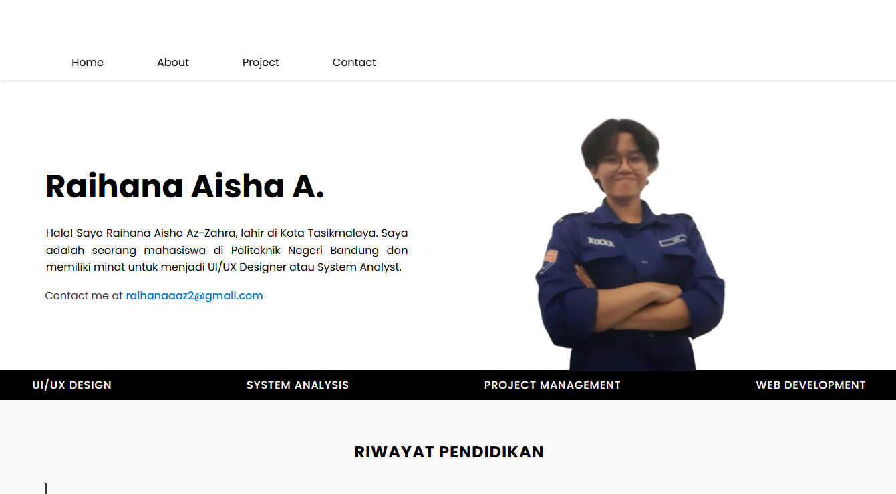

# 🌟 Raihana Aisha - Web Portofolio

## 📄 Deskripsi Proyek
Web portofolio ini dibuat sebagai **media showcase diri** untuk keperluan melamar kerja atau freelance.  
Di dalamnya terdapat informasi penting seperti:  

- 👤 **Data diri singkat**  
- 🛠️ **Skill dan kemampuan**  
- 🎓 **Riwayat pendidikan**  
- 💼 **Pengalaman kerja**  
- 📁 **Project yang pernah dan sedang dikerjakan**  
- ✉️ **Kontak untuk komunikasi**  

Tujuannya adalah memberikan **kesan profesional dan mudah diakses** bagi calon klien atau perusahaan.

---

## 🛠️ Teknologi yang Digunakan

| Teknologi | Fungsi |
|-----------|--------|
|  | Membuat **struktur halaman**, seperti header, section, form, dan footer |
|  | Styling halaman, termasuk layout, font, warna, spacing, dan responsivitas |
|  | Membuat **alert dan notifikasi interaktif**, misalnya pesan sukses/gagal saat submit form |
|  | Mengirim **email langsung dari form kontak** tanpa backend |

---

## ⚡ Fitur Utama
- 🌐 **Responsif** untuk desktop, tablet, dan HP  
- 📨 **Form kontak interaktif** menggunakan SweetAlert2  
- 📬 **Integrasi EmailJS** untuk mengirim pesan ke Gmail langsung dari web  
- 📂 **Showcase project, skill, pendidikan, pengalaman** secara rapi  

---

## 🎨 Tampilan
  
  

*(Ganti gambar dengan screenshot web kamu jika ada)*

---

## 🚀 Deploy
Hasil akhir proyek bisa diakses melalui link berikut:  

[🌐 Lihat Web Portofolio](#)  
*(Ganti `#` dengan URL Netlify atau hosting lainnya)*  

---

## 📌 Catatan
- Form kontak menggunakan **EmailJS** → tidak membutuhkan backend  
- Notifikasi interaktif menggunakan **SweetAlert2** → lebih menarik daripada alert bawaan browser  
- Semua **font, warna, layout** sudah dibuat responsif untuk semua perangkat  desktop, tablet, dan phone

---


```markdown
[](#)
